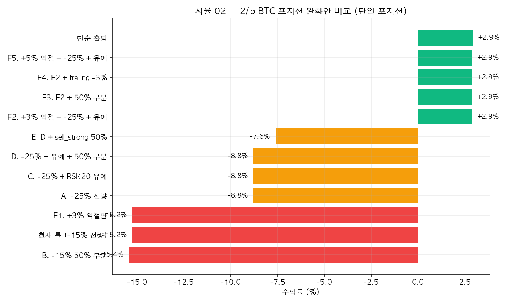
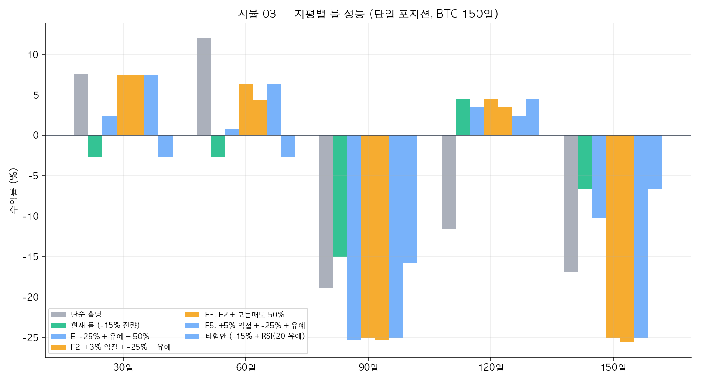
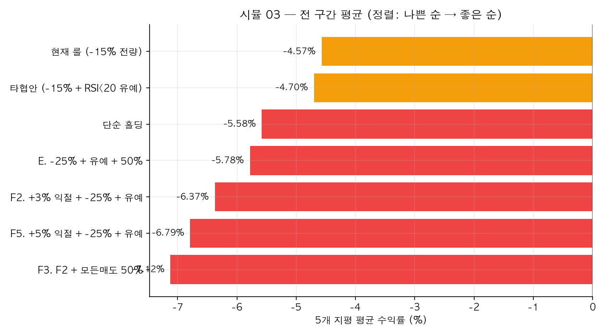
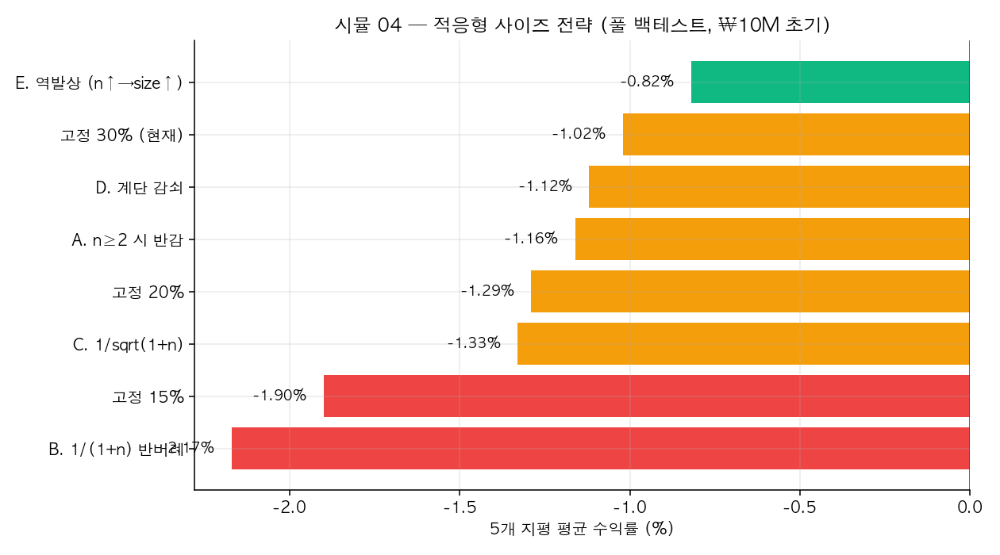

# 매매 룰 검증 시뮬레이션

CLAUDE.md의 매매 룰이 실제 시장 데이터에서 어떻게 작동하는지 백테스트한 결과 모음.
2026-04-18 기준, BTC 15분봉 데이터(pyupbit)로 검증.

## 발단

> 2/5 BTC 저점에서 알고리즘이 매수했어도 그 후 팔지 않고 가질 수 있었을까?

원래 질문은 단순했지만, 파고들수록 룰 자체의 구조적 문제가 드러남. 여러 완화안을 시도하고
결국 "현재 룰이 생각보다 나쁘지 않다"는 결론에 도달하기까지의 여정.

## 폴더 구조

```
simulations/
├── README.md                       ← 이 파일
├── scripts/
│   ├── common.py                   ← 공용 백테스트 엔진 (벡터화 지표 + 룰 파라미터)
│   ├── 01_feb5_position.py         ← 2/5 BTC 단일 포지션 추적
│   ├── 02_mitigation_variants.py   ← 완화안 A~F 11종 비교
│   ├── 03_multi_horizon.py         ← 5개 시간 지평에서 룰 비교
│   ├── 04_adaptive_sizing.py       ← 적응형 매수 사이즈 8종 비교
│   └── make_charts.py              ← CSV → PNG 차트 생성
├── results/
│   ├── 01_feb5_position.csv
│   ├── 02_mitigation_variants.csv
│   ├── 03_multi_horizon.csv
│   └── 04_adaptive_sizing.csv
└── charts/
    ├── 02_mitigation_variants.png
    ├── 03_multi_horizon.png
    ├── 03_multi_horizon_avg.png
    └── 04_adaptive_sizing.png
```

## 재실행

```bash
cd simulations/scripts
../../venv/bin/python3 01_feb5_position.py
../../venv/bin/python3 02_mitigation_variants.py
../../venv/bin/python3 03_multi_horizon.py
../../venv/bin/python3 04_adaptive_sizing.py
../../venv/bin/python3 make_charts.py
```

`common.py`의 `fetch_candles(end=...)`는 기본값이 2026-04-18. 현 시점에서 재실행하면
pyupbit가 최신 데이터를 반환하므로 결과는 시기에 따라 달라질 수 있음.

## 룰 파라미터 (`common.py:RuleConfig`)

| 필드 | 기본값 | 의미 |
|---|---|---|
| `backstop_pct` | -0.15 | 평단 대비 X% 하락 시 전체 백스톱 발동 |
| `trailing_pct` | -0.07 | 수익 구간에서 고점 대비 X% 하락 시 매도 |
| `partial_backstop` | 1.0 | 백스톱 발동 시 매도 비율 (1.0=전량) |
| `rsi_pause_below` | None | RSI가 이 값 미만이면 백스톱 유예 |
| `sell_strong_min_profit` | None | 평단 대비 +X% 이상일 때만 sell_strong 발동 |
| `sell_strong_ratio` | 1.0 | sell_strong 매도 비율 |

---

## 시뮬 01 — 2/5 BTC 포지션 추적

**질문:** 2/5 00:00에 BTC 매수했다면 현재(2026-04-18)까지 끌고 왔을까?

**방법:** 2/5 시가 ₩110.6M에 ₩1M 상당 매수한 단일 포지션. 각 룰 변형 적용.

**결과:**

| 룰 | 결과 | 핵심 이벤트 |
|---|---:|---|
| 현재 룰 (-15% 전량) | **-15.25%** | 2/6 05:30 백스톱 발동, ₩93.87M에 전량 매도 (바닥권) |
| A. -25% 전량 | -8.79% | 2/14 sell_strong에서 ₩101M에 매도 |
| E. -25% + 유예 + 50% 부분 | -7.60% | sell_strong 4회 분할 매도 |
| **F2. +3% 익절 + -25% + 유예** | **+2.87%** | **매도 0회, 홀딩과 동일** |
| 단순 홀딩 | +2.92% | 벤치마크 |

**결론:**
현재 룰은 폭포수 하락에 **바닥에서 손절하는 kill switch**로 작동. F2(익절 조건 + 백스톱 완화)는
모든 매도를 우회하고 단순 홀딩을 복제. **단, 이건 빠른 반등 시나리오에 최적화된 결과.**

---

## 시뮬 02 — 완화안 11종 비교 (단일 포지션)

시뮬 01의 2/5 포지션에 완화 아이디어를 체계적으로 대입.



**핵심 발견:**

- **F시리즈(+3% 익절 + -25% 백스톱 + RSI<20 유예)** 가 홀딩(+2.92%)을 거의 완벽히 복제
- **백스톱만 완화**(A, C, D)해도 -15% → -9%로 큰 개선
- **sell_strong에 익절 조건** 붙이는 게 가장 효과 큼 — 반등 꼭지에서 손실 구간 매도 차단
- `trailing -3%`(F4)는 역효과. 정상적 되돌림에도 털림

**이때의 성급한 결론:** "F2를 도입하면 된다."  
**이 결론이 어떻게 뒤집히는지는 시뮬 03을 볼 것.**

---

## 시뮬 03 — 여러 시간 지평에서 룰 비교

**핵심 교훈: 한 시나리오(2/5)로 룰을 튜닝하면 과최적화 함정에 빠진다.**

30/60/90/120/150일 전 시점에 매수한 포지션 각각에 같은 룰을 적용.





| 룰 | 30일 | 60일 | 90일 | 120일 | 150일 | **평균** |
|---|---:|---:|---:|---:|---:|---:|
| 단순 홀딩 | +7.59% | +11.99% | -18.96% | -11.59% | -16.93% | -5.58% |
| **현재 룰 (-15%)** | -2.76% | -2.75% | **-15.12%** | **+4.48%** | **-6.69%** | **-4.57%** ⭐ |
| E. -25% + 유예 + 50% | +2.38% | +0.79% | -25.28% | +3.43% | -10.21% | -5.78% |
| F2. +3% 익절 + -25% + 유예 | +7.53% | +6.31% | **-25.08%** | +4.48% | **-25.08%** | -6.37% |
| F3. F2 + 모든매도 50% | +7.53% | +4.33% | -25.28% | +3.43% | -25.61% | -7.12% |
| F5. +5% 익절 + -25% + 유예 | +7.53% | +6.31% | -25.08% | +2.37% | -25.08% | -6.79% |
| 타협안 (-15% + RSI<20 유예) | -2.76% | -2.75% | -15.77% | +4.48% | -6.69% | -4.70% |

**시장 조건별 패턴:**
- 30·60일: **상승장** (바닥 근처 진입 → 반등 흐름). F시리즈 압승.
- 90·120·150일: **하락장** (고점 진입 → 지속 하락). 현재 룰의 -15% 손절이 생명선.

**F2의 치명적 맹점:** 백스톱 -25% + 익절 조건 때문에 긴 하락장에서 **-25% 풀로 물림**.
150일 시나리오에서 F2는 -25.08%, 현재 룰은 -6.69%. 현재 룰이 18%p 우위.

**타협안도 의미 없음:** "RSI<20 유예만 추가"는 90일에서 한 번 발동했고, 그마저도 살짝 악화.
2/5 케이스의 "RSI 극저 + 즉각 반등" 패턴이 일반화되지 않음을 시사.

**결론:** 현재 룰의 -15% 백스톱 + 전량 매도는 **평균 성능이 가장 우수**하고,
"매수 직후 급락"과 "장기 고점 진입 후 하락" 양쪽 시나리오 모두에서 견고.

---

## 시뮬 04 — 적응형 매수 사이즈 (풀 백테스트)

룰 튜닝의 한계를 인식한 후 "룰은 그대로, 사이즈만 바꾸면?" 관점 전환.
**₩10M 초기 자본 풀 백테스트** — 매수/매도 모두 알고리즘대로 사이클 돌림.



| 전략 | 30일 | 60일 | 90일 | 120일 | 150일 | **평균** | 거래 |
|---|---:|---:|---:|---:|---:|---:|---:|
| 고정 30% (현재) | +5.19% | +7.54% | -7.07% | -5.02% | -5.75% | -1.02% | 456 |
| 고정 20% | +5.18% | +7.56% | -7.07% | -5.78% | -6.34% | -1.29% | 536 |
| 고정 15% | +5.20% | +7.49% | -8.07% | -6.80% | -7.33% | -1.90% | 618 |
| A. n≥2 시 반감 | +5.17% | +7.39% | -7.06% | -5.42% | -5.90% | -1.16% | 491 |
| B. 1/(1+n) 반비례 | +4.96% | +7.13% | **-8.39%** | **-7.10%** | -7.46% | **-2.17%** ❌ | 594 |
| C. 1/sqrt(1+n) | +5.10% | +7.31% | -7.27% | -5.68% | -6.11% | -1.33% | 516 |
| D. 계단 감쇠 | +5.14% | +7.36% | -7.13% | -5.24% | -5.74% | -1.12% | 499 |
| **E. 역발상 (n↑→size↑)** | **+5.21%** | **+7.78%** | **-6.77%** | **-4.74%** | **-5.57%** | **-0.82%** ⭐ | 450 |

`size_fn(n)` 는 "최근 4시간 내 매수 횟수 n 을 받아 기본 사이즈의 배수를 반환"하는 함수.

**발견:**

1. **"빈도 높으면 줄이자"는 직관은 전부 실패 (A, B, C, D 모두 기본보다 저조)**
   - 신호 클러스터는 단순 노이즈가 아닌 **바닥 신호**. 움츠러들면 기회 놓침
   - 가장 보수적인 B(1/(1+n))가 최악 (-2.17% 평균)

2. **역발상 E가 전 구간 승리** — 빈도 높을수록 사이즈 확대
   - `min(1.5, 1 + 0.15n)`로 최대 1.5배까지 키움
   - 평균 +0.21%p 개선 (-1.02% → -0.82%)
   - 거래 횟수 450으로 가장 적음 — 일찍 50% 포지션 상한 도달

3. **고정 사이즈 축소는 역효과** — 15%로 줄이면 상승장 이익 못 누림

4. **현재 룰이 풀 백테스트에서 생각보다 선방** — 평균 -1.02%. 이전 단일 포지션 분석(-15% 털림)은
   매도 후 재진입 못 하는 극단 케이스였고, 실제 사이클에선 복구됨.

**개선 효과(+0.21%p)가 크지 않아 프로덕션 도입은 추가 검증(다른 코인, 더 긴 기간) 후 결정 권장.**

---

## 종합 결론

이 과정을 거친 후 내린 판단:

1. **현재 룰은 다양한 시장 조건에서 가장 안정적**. 건드리지 말 것.
2. 개별 시나리오(2/5 같은)에서 나빠 보여도, 평균 성능은 가장 우수.
3. 튜닝 아이디어 대부분은 **과최적화**. 한 시나리오에 맞춰 룰을 바꾸면 다른 시나리오가 깨짐.
4. 완화안 도입 전에는 **반드시 여러 시장 조건에서 검증** 필요.
5. 역발상 사이즈(E)가 유일하게 미세 우위지만, 개선 폭이 작아 현재로선 보류.

## 방법론 한계

- **단일 종목(BTC)만 검증**. 실제 포트폴리오는 10종 분산이라 결과가 다를 수 있음.
- **수수료는 적용**, 슬리피지/호가 차이는 무시. 실전 체결과 편차 가능.
- **룩어헤드 바이어스 없음** — 각 시점의 지표는 그때까지 데이터만 사용.
- **매수 후 30분 홀딩 제한**은 `full_backtest`에 반영 안 됨. 실전에선 추가 보수적.
- 150일은 짧은 편. 과거 강세장/약세장 전체 사이클 평가엔 1~2년 데이터 필요.

## 향후 검증 제안

- 같은 룰을 ETH, XRP, SOL 등에 개별 적용 → 코인별 성능 차이 확인
- 포트폴리오 단위 풀 백테스트 (10종 동시, 현금 공유)
- 1년 이상 데이터로 롤링 윈도우 평가 (안정성 측정)
- 슬리피지/체결 실패 반영한 realistic 시뮬
